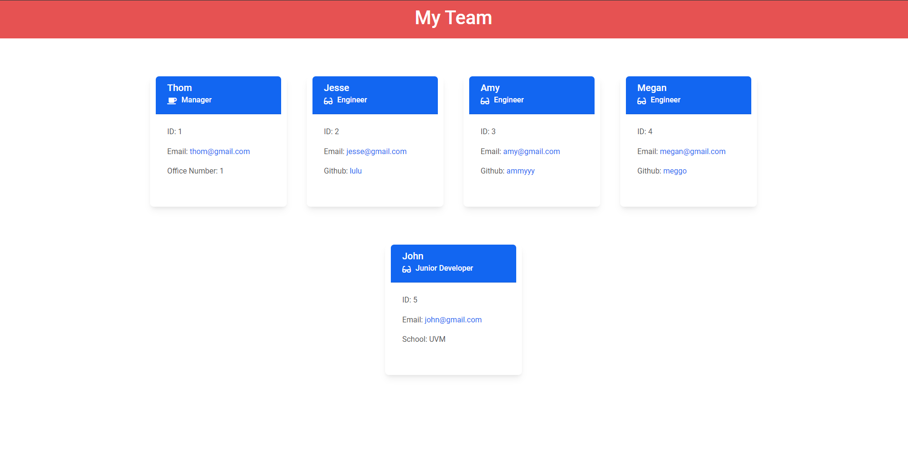

# Team Profile Generator

## Description 
This is a Node.js command-line application that utilizes the Inquirer module to dynamically create a team profile from user input data.

## Table of Contents
* [Installation](#installation)
* [Usage](#usage)
* [License](#license)
* [Contributing](#contributing)
* [Tests](#tests)
* [Questions](#questions)

## installation
The user should clone the repository from GitHub and download Node. This application also requires a file system and inquirer module. If testing is required, this application uses Jest. 

## Usage
Use inquirer from the command line to answer questions about your team.  
View walkthrough video here https://youtu.be/YG6fI2XAZbc

## License 
This project is license under MIT

## Contributing 
Contributors should read the installation section. 

## Tests
Run `npm test` to run Jest for tests on constructors. 

## Questions
If you have any questions about this projects, please contact me directly at thomle0418@gmail.com. You can view more of my projects at https://github.com/vietthom.